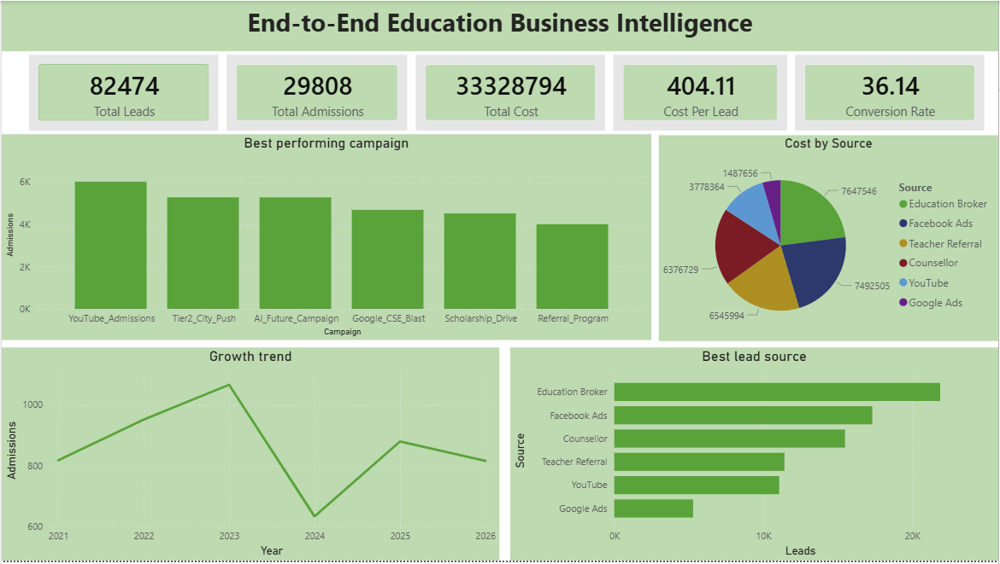

# 🎓 End-to-End Education Analytics Dashboard  
### Power BI | Business Intelligence | ROI & Marketing Performance Analysis

---

## 📌 Project Overview

The **End-to-End Education Analytics Dashboard** is a complete Business Intelligence solution built using **Power BI** to analyze and optimize the performance of an education institution.

This project transforms raw admission, marketing, cost, and placement data into **actionable business insights**, helping stakeholders:

- Improve marketing ROI
- Identify best-performing lead sources
- Optimize cost per admission
- Monitor placement success
- Track student growth trends

The dashboard provides a 360° view of the student lifecycle — from **lead generation to placement outcomes**.

---

# 🎯 Business Objectives

✔ Analyze marketing campaign effectiveness  
✔ Identify best & lowest cost acquisition sources  
✔ Track admissions growth trends  
✔ Measure placement rate & ROI  
✔ Evaluate company-wise placement performance  
✔ Support data-driven decision-making  

---

# 📊 Dashboard Pages Overview

---

## 🟢 Page 1: Source & Cost Optimization Analysis

### Key KPIs:
- Fact Total Admissions
- Average Cost
- Lowest Cost Source
- Best Source Name

### Visual Insights:
- Admissions by Source
- Cost Per Admission by Source

### 📸 Screenshot:



---

## 🟢 Page 2: Executive Performance & Placement Overview

### Key KPIs:
- Total Students
- Placement Rate %
- ROI %
- Total Placements

### Visual Insights:
- CTC Distribution (Monthly / Annual / Internship)
- Placement by Company
- Admission Year Analysis
- Course & City Distribution

### 📸 Screenshot:


---

## 🟢 Page 3: Admissions & Marketing Performance

### Key KPIs:
- Total Leads
- Total Admissions
- Total Cost
- Cost Per Lead
- Conversion Rate %

### Visual Insights:
- Best Performing Campaign
- Cost Distribution by Source
- Growth Trend (Year-wise)
- Best Lead Source

### 📸 Screenshot:


---

# 📈 Key Business Insights Derived

🔹 YouTube generated the highest admissions  
🔹 Google Ads had the lowest cost per admission  
🔹 Overall Placement Rate achieved: **70%**  
🔹 ROI achieved: **426%**  
🔹 Peak admission growth observed in 2023  
🔹 Education Broker & Facebook Ads are strong performing channels  

---

# 🧠 Data Model Architecture

The project follows a **Star Schema Model**:

### Dimension Tables:
- `Dim_Student`
- `Dim_Company`
- `Dim_Date`

### Fact Tables:
- `Fact_Admissions_Monthly`
- `Fact_Campaign_Performance`
- `Fact_Executive_ROI`
- `Fact_Placements`
- `Fact_Student_Skills`

This structure ensures:
- Optimized performance
- Clean relationships
- Scalable BI modeling

---

# 🧮 Important DAX Measures Used

```DAX
Total Admissions = SUM(Fact_Admissions_Monthly[Admissions])

Cost Per Lead = 
DIVIDE(
    SUM(Fact_Campaign_Performance[MarketingSpend]),
    SUM(Fact_Campaign_Performance[Leads])
)

Conversion Rate % =
DIVIDE(
    [Total Admissions],
    SUM(Fact_Campaign_Performance[Leads])
) * 100

ROI % =
DIVIDE(
    SUM(Fact_Executive_ROI[PlacementValue]) - 
    SUM(Fact_Executive_ROI[TotalCost]),
    SUM(Fact_Executive_ROI[TotalCost])
) * 100
```

---

# 📂 Repository Structure

```
End_to_End_Education_Analytics/
│
├── dashboard_images/
│   ├── Admissions_Analysis.png
│   ├── Campaign_Performance_Dashboard.png
│   └── Executive_Performance_Placement.png
│
├── dataset/
│   └── FINAL_PowerBI_Education_Analytics_5000Rows.xlsx
│
├── End_to_End_Education_Analytics.pbix
│   
│
├── README.md
└── .gitignore
```

---

# 📊 Dataset Information

- 5000 Student Records
- Data Range: 2021 – 2026
- Includes:
  - Marketing Spend
  - Training Spend
  - Placement Value
  - Campaign Data
  - Lead Sources
  - Student Courses
  - Company Placements

---

# 🛠 Tools & Technologies Used

- **Power BI**
- Power Query (ETL)
- DAX (Data Analysis Expressions)
- Excel (Data Source)
- Git & GitHub (Version Control)

---

# 🚀 How to Run the Project

1. Clone the repository:
   ```bash
   git clone https://github.com/itsarunrai/End_to_End_Education_Analytics.git
   ```

2. Open the `.pbix` file in Power BI Desktop

3. Refresh the data (if required)

4. Explore the dashboards interactively

---

# 📌 Skills Demonstrated

- Data Modeling (Star Schema)
- DAX Calculations
- Business KPI Design
- Marketing Performance Analytics
- ROI Analysis
- Dashboard Storytelling
- Cost Optimization Strategy
- Git Version Control

---

# 👨‍💻 Author

**Arun Rai**  
Final Year CSE Student  
Aspiring Data Analyst | Business Intelligence Developer  

---

# ⭐ If you found this project useful, consider giving it a star!
